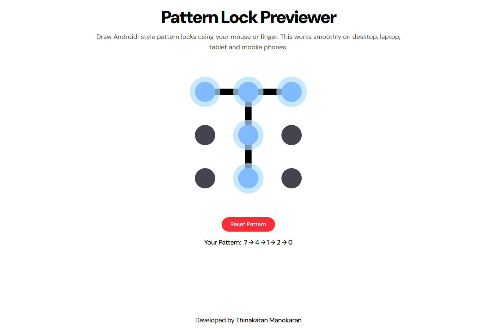

# 🔒 Pattern Lock Preview

<p align="center">
  
</p>

<p align="center">
  <b>Interactive Android Pattern Lock Simulator for Web</b>
</p>

<p align="center">
  
</p>

---

## 🌐 Live Demo

👉 [https://thinakaranmanokaran.github.io/PatternLock_Preview/](https://thinakaranmanokaran.github.io/PatternLock_Preview/)

---

## ✨ Features

* 🖱 Works with **mouse** on desktop/laptop
* 📱 Works with **finger touch** on mobile/tablet
* ⚡ Smooth animated connections
* 🎨 Real-time dot highlighting
* 🔄 Auto reset after pattern draw
* 🔥 Modern UI with Tailwind CSS

---

## 🛠 Built With

* React (Vite)
* Tailwind CSS
* Pointer Events API
* GitHub Pages

---

## 🚀 Getting Started

### 1️⃣ Clone the repo

```bash
git clone https://github.com/thinakaranmanokaran/PatternLock_Preview.git
cd PatternLock_Preview
```

### 2️⃣ Install dependencies

```bash
npm install
```

### 3️⃣ Run locally

```bash
npm run dev
```

---

## 📁 Project Structure

```
PatternLock_Preview/
├── public/
│   ├── preview.png
│   ├── favicon512.png
│   └── other favicons...
├── src/
│   ├── App.jsx
│   └── main.jsx
└── index.html
```

---

## 👨‍💻 Author

**Thinakaran Manokaran**
🌐 Portfolio: [https://thinakaran.dev/](https://thinakaran.dev/)

---

## ⭐ Support

If you like this project, please give it a **star** on GitHub 🌟
